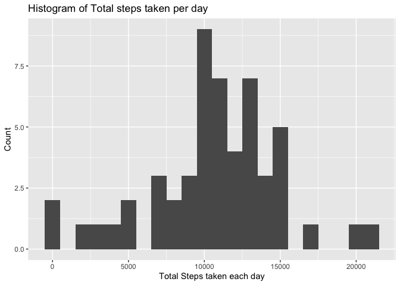
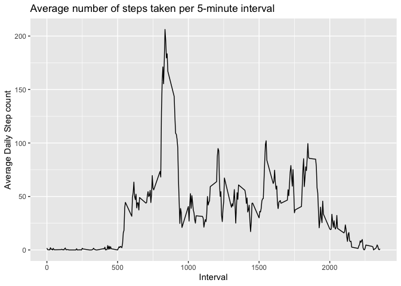
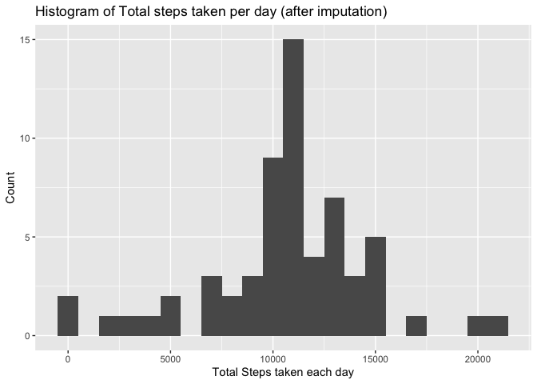
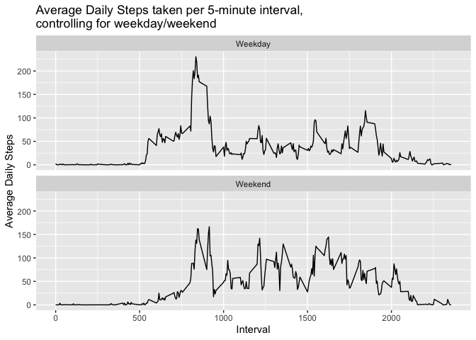

## Introduction

It is now possible to collect a large amount of data about personal
movement using activity monitoring devices such as a
[Fitbit](http://www.fitbit.com), [Nike
Fuelband](http://www.nike.com/us/en_us/c/nikeplus-fuelband), or
[Jawbone Up](https://jawbone.com/up). These type of devices are part of
the "quantified self" movement -- a group of enthusiasts who take
measurements about themselves regularly to improve their health, to
find patterns in their behavior, or because they are tech geeks. But
these data remain under-utilized both because the raw data are hard to
obtain and there is a lack of statistical methods and software for
processing and interpreting the data.

This assignment makes use of data from a personal activity monitoring
device. This device collects data at 5 minute intervals through out the
day. The data consists of two months of data from an anonymous
individual collected during the months of October and November, 2012
and include the number of steps taken in 5 minute intervals each day.


## Loading and preprocessing the data

First, load the data. Unzip file if necessary, and then read-in the required csv file


```r
library(tidyverse)

if (!file.exists("UCI HAR Dataset")) { 
unzip("activity.zip") 
}

activity <- read_csv("activity.csv")
```

We know the following about the data (from the assignment details):

The variables included in this dataset are:

* **steps**: Number of steps taking in a 5-minute interval (missing
    values are coded as `NA`)

* **date**: The date on which the measurement was taken in YYYY-MM-DD
    format

* **interval**: Identifier for the 5-minute interval in which
    measurement was taken

There are a total of 17,568 observations in this dataset.

Let's check the data to confirm:


```r
glimpse(activity)
```

```
## Observations: 17,568
## Variables: 3
## $ steps    <int> NA, NA, NA, NA, NA, NA, NA, NA, NA, NA, NA, NA, NA, NA,…
## $ date     <date> 2012-10-01, 2012-10-01, 2012-10-01, 2012-10-01, 2012-1…
## $ interval <int> 0, 5, 10, 15, 20, 25, 30, 35, 40, 45, 50, 55, 100, 105,…
```


## What is mean total number of steps taken per day?

Let's summarise the total number of steps taken each day, and then plot a histogram of the steps per day:


```r
steps_per_day <- activity %>% 
  group_by(date) %>% 
  summarise(steps = sum(steps))

ggplot(steps_per_day, aes(x=steps)) +
  geom_histogram(binwidth = 1000) +
  labs(x = "Total Steps taken each day",
       y = "Count",
       title = "Histogram of Total steps taken per day")
```

```
## Warning: Removed 8 rows containing non-finite values (stat_bin).
```

<!-- -->

Let's also calculate the mean and median of these steps per day:


```r
mean_steps_per_day <- mean(steps_per_day$steps, na.rm = TRUE)
median_steps_per_day <- median(steps_per_day$steps, na.rm = TRUE)

mean_steps_per_day 
```

```
## [1] 10766.19
```

```r
median_steps_per_day
```

```
## [1] 10765
```

So the mean steps per day is approx 10,766 and the median steps per day is 10,765.

## What is the average daily activity pattern?

Let's plot the average number of steps taken at each 5-minute interval through the day:

```r
avg_daily <- activity %>% 
  group_by(interval) %>% 
  summarise(avg_steps = mean(steps, na.rm = TRUE))

ggplot(avg_daily, aes(x = interval, y = avg_steps)) +
  geom_line() +
  labs(x = "Interval", y = "Average Daily Step count",
       title = "Average number of steps taken per 5-minute interval")
```

<!-- -->

There is a clear peak at around the 800 interval, let's confirm what this peak is:

```r
max_int <- avg_daily %>% 
  filter(avg_steps == max(avg_steps))

max_int
```

```
## # A tibble: 1 x 2
##   interval avg_steps
##      <int>     <dbl>
## 1      835      206.
```

So the maximum average number of steps is 206, occuring at interval 835.

## Imputing missing values

The number of steps is missing for certain days/intervals. Let's assess how many records are missing:

```r
missing_records <- activity %>% 
  filter(is.na(steps)) %>% 
  nrow()

missing_records
```

```
## [1] 2304
```

So there are 2304 rows missing step count in the dataset.

Let's impute these missing values, using the mean of the non-missing records for that interval.
I have the means for each interval from the `avg_daily` dataset created in last section. Let's join these to the `activity` dataset, by interval, and then use this value to replace the missing step values (rounding the average number of steps to nearest integer):


```r
activity_imp <- activity %>% 
  inner_join(avg_daily, by = "interval") %>% 
  mutate(steps = if_else(is.na(steps), as.integer(round(avg_steps)), steps)) %>% 
  select(-avg_steps)

glimpse(activity_imp)
```

```
## Observations: 17,568
## Variables: 3
## $ steps    <int> 2, 0, 0, 0, 0, 2, 1, 1, 0, 1, 0, 0, 0, 1, 0, 0, 0, 1, 2…
## $ date     <date> 2012-10-01, 2012-10-01, 2012-10-01, 2012-10-01, 2012-1…
## $ interval <int> 0, 5, 10, 15, 20, 25, 30, 35, 40, 45, 50, 55, 100, 105,…
```

Now let's summarise the total number of steps a day using this new dataset with the missing data imputed:

```r
steps_per_day_imp <- activity_imp %>% 
  group_by(date) %>% 
  summarise(steps = sum(steps))

ggplot(steps_per_day_imp, aes(x=steps)) +
  geom_histogram(binwidth = 1000) +
  labs(x = "Total Steps taken each day",
       y = "Count",
       title = "Histogram of Total steps taken per day (after imputation)")
```

<!-- -->

Let's also re-calculate the mean and median:

```r
new_mean <- mean(steps_per_day_imp$steps)
new_median <- median(steps_per_day_imp$steps)

new_mean
```

```
## [1] 10765.64
```

```r
new_median
```

```
## [1] 10762
```

Both the new mean and median measurements are very similar to their original measurements when missings were ignored.

*  The new mean is approx 10,766 which is 0.55 steps lower than original mean. 
*  The new median is 10762 which is 3 steps lower than original median. 

## Are there differences in activity patterns between weekdays and weekends?

Let's create a new variable in the data to distinguish between a weekday or a Saturday/Sunday:

```r
activity_imp <- activity_imp %>% 
  mutate(day_type = if_else(weekdays(date) %in% c("Saturday", "Sunday"), "Weekend", "Weekday"),
         day_type = as_factor(day_type))

glimpse(activity_imp)
```

```
## Observations: 17,568
## Variables: 4
## $ steps    <int> 2, 0, 0, 0, 0, 2, 1, 1, 0, 1, 0, 0, 0, 1, 0, 0, 0, 1, 2…
## $ date     <date> 2012-10-01, 2012-10-01, 2012-10-01, 2012-10-01, 2012-1…
## $ interval <int> 0, 5, 10, 15, 20, 25, 30, 35, 40, 45, 50, 55, 100, 105,…
## $ day_type <fct> Weekday, Weekday, Weekday, Weekday, Weekday, Weekday, W…
```

How do the average daily steps for each interval compare, when split by weekday and weekend?:


```r
avg_daily_type <- activity_imp %>% 
  group_by(day_type, interval) %>% 
  summarise(avg_steps = mean(steps))

ggplot(avg_daily_type, aes(x = interval, y = avg_steps)) +
  geom_line() +
  facet_wrap(~ day_type, ncol = 1) +
  labs(x = "Interval", y = "Average Daily Steps",
       title = "Average Daily Steps taken per 5-minute interval,\ncontrolling for weekday/weekend")
```

<!-- -->

For both weedays and weekends, their tends to be a spike around interval 800, although the weekday spike is more pronounced.

Between intervals 1000 to 1700 the weekend averages tend to be higher than weekdays.
